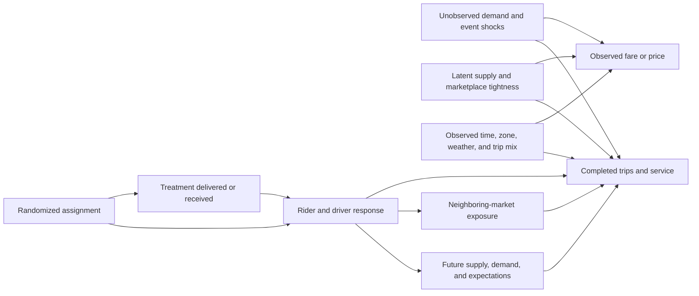

# Identification and limitations audit

**Purpose:** State what must be true for each causal claim, how those conditions can fail, and what evidence would change the interpretation.  
**Current evidence status:** The committed 300-trip Chicago vertical slice supports the offline
causal-research workflow; the separately pinned full-month NYC object and weather, neighborhood-
income, and permitted-event sources support descriptive evidence only. Causal-recovery, HTE,
design-sensitivity, and policy-holdout artifacts remain semi-synthetic or theoretical. The robust
design gate withholds a full-grid recommendation, and HTE fails its recovery gate. This document
audits claims; it does not turn public-data descriptions or simulator values into live causal
results.

**Generated evidence audited here:** `artifacts/reports/technical_report_generated.md`,
`artifacts/reports/product_decision_memo_generated.md`, `artifacts/reproduce_manifest.json`, and
the independently manifested `artifacts/nyc_full/{weather,income,events}/` bundles.

## 1. Bottom line

The public trip panel supports descriptive marketplace facts and simulator calibration. It does not identify the causal effect of fares, rider discounts, or driver incentives. Causal validation in this repository comes from randomized assignments inside a semi-synthetic marketplace with known potential outcomes. That validation establishes whether a design and estimator recover the simulator's target under declared scenarios; it does not establish that the simulator's treatment magnitude transports to a live city.

For a live rollout question, the preferred target is a market-total feasible-policy effect. Geographic or geo × time randomization can identify that target only to the extent that the market boundary, exposure mapping, treatment history, delivery rule, and inference reflect actual rider and driver connections. The design-aligned assignment ITT remains a separate estimand unless those conditions make it coincide with the rollout contrast. A technically precise estimate of the wrong exposure contrast is not a valid rollout answer.

## 2. Causal structure

The observational price-demand relationship is confounded and jointly determined, while a randomized incentive can also propagate through neighboring markets and later periods.

Adjustment for (X) does not generally block the unobserved paths through (U) and (S), and price can be part of the treatment mechanism. Random assignment (Z) provides causal variation, but the relevant potential outcome is (Y(a,e,h)): own treatment (a), spillover exposure (e), and history (h). The no-interference shorthand (Y(a)) requires justification rather than assumption.

## 3. Evidence boundary

| Claim | Best available evidence in this project | Interpretation |
|---|---|---|
| Zone occupancy differs in the fixture | Public trip panel | Empirical association in sampled records; hour totals are fixed by the quota query, so temporal demand is not identified |
| Fare and trips co-move | Public trip panel | Descriptive; not a causal elasticity |
| Weather and completed trips co-move in January | Pinned NOAA Central Park join to the NYC panel | Descriptive association using one citywide proxy; not a causal weather effect or instrument |
| Completed trips differ across ACS area-income groups | Official 2022 five-year B19001 distributions allocated through an equal-area Taxi Zone/NTA crosswalk | Ecological association for classified residential areas; not individual rider/driver income or an income effect |
| Completed trips differ across permit-intensity calendar groups | Complete January NYC permit snapshot joined as a citywide daily proxy | Descriptive and calendar-confounded; permits are not attendance or realized zone/hour exposure |
| An estimator recovers a declared effect | Monte Carlo versus simulator ground truth | Semi-synthetic causal validation |
| Interference causes target mismatch or bias in a scenario | Known-exposure simulation | Semi-synthetic causal result conditional on the scenario |
| Mapped effects are recovered on NYC OD geometry | Randomized known-truth DGP on a fixed pre-treatment graph | Semi-synthetic exposure-method validation; graph weight is not spillover strength |
| A paired policy fixed point differs from control | Declared equilibrium equations | Theoretical within-model counterfactual; not an empirical or NYC structural estimate |
| One design is preferable for a configured scenario distribution | Generated design benchmark | Decision projection conditional on parameters and loss function |
| A targeting policy improves value | Honest holdout simulation | Semi-synthetic policy result; not guaranteed live lift |
| A live incentive improves marketplace welfare | Live randomized experiment plus a credible welfare ledger | Not identified by public trip records or simulation alone |

Failure to reject a null in a low-powered benchmark or experiment is not evidence of zero effect.
Likewise, generated simulator quantities are conditional validation results, not live-market
magnitudes.

## 4. Core identification conditions

### Well-defined intervention and consistency

The intervention must specify amount, eligibility, delivery channel, duration, saturation, budget throttling, and geographic/time rules. “Discount” is not one treatment if eligible riders receive different prices or messages under undocumented rules. Consistency requires observed outcomes under the delivered policy version to equal the corresponding potential outcomes.

**Failure modes:** mid-experiment version changes, operational overrides, unlogged delivery failures, multiple incentive types under one label, or interference pathways outside the declared policy.

**Mitigation:** version treatment, log assignment/delivery/receipt separately, freeze material rules, and redefine the estimand when versions change.

### Randomization / conditional exchangeability

Assignment must follow the recorded probabilities. For randomized designs, causal exchangeability derives from that mechanism, not from post hoc balance. For observational comparisons, a no-unmeasured-confounding claim would be required and is not credible for price using the trip panel alone.

**Failure modes:** manual overrides, budget-dependent assignment, randomization bugs, attrition correlated with treatment, or analyst-defined exclusions using post-treatment information.

**Mitigation:** archive the assignment table and seed, reproduce allocations, compare planned with delivered probabilities, and analyze ITT.

### Positivity and exposure support

Each target contrast needs positive probability under the assignment mechanism. With interference, this applies to combinations of own treatment, neighbor exposure, and relevant history, not only treatment/control.

**Failure modes:** all central zones treated, no untreated units with high exposure, deterministic budget throttling, or switchback sequences that never generate needed histories.

**Mitigation:** simulate exposure support before launch, constrain randomization to preserve overlap, and narrow the estimand rather than extrapolate outside support.

### Correct analysis of the assignment unit

The effective sample size is determined by independent randomized units and dependence, not raw trip rows. Outcomes aggregated below the assignment unit remain correlated.

**Failure modes:** individual standard errors after cluster assignment, treating repeated time blocks as independent, or using a large trip count to conceal few clusters.

**Mitigation:** randomization inference, cluster-aware variance, small-sample corrections, and explicit reporting of randomized clusters and sequences.

### Outcome observability and stable measurement

Treatment must not change observation in an unmodeled way. Marketplace data can omit unserved requests, off-platform substitution, canceled trips, driver opportunity cost, or activity outside the query boundary.

**Failure modes:** measuring completed trips without requests, suppressing small cells differently after treatment, or treatment-induced changes in product mix that alter fare definitions.

**Mitigation:** preserve measurement flags, use request/service metrics when possible, reconcile logs, and expand the outcome ledger and market boundary.

## 5. Observational public-data limitations

### Price endogeneity

Observed fare or price is a marketplace outcome. It can respond to demand shocks, available supply, congestion, trip distance, product selection, location, and platform rules. Several of those factors also determine trip volume. Thus

\[
\mathbb{E}[Y\mid P=p_1,X]-\mathbb{E}[Y\mid P=p_0,X]
\]

is generally not the causal effect of setting price from (p_0) to (p_1), even with time and zone controls. A causal elasticity would require a credible instrument, randomized price variation, discontinuity, policy experiment, or defensible structural model with sensitivity analysis. None should be implied by descriptive panel regressions.

### Selection into observed trips

Trip records usually describe completed or reported trips, not every rider request or latent demand opportunity. Conditioning on completed trips can select on matching and service, which are affected by supply and market tightness. Average fare or duration among completed trips can change because treatment changes which trips complete, even if no individual's fare or duration response changes.

### Suppression, rounding, and missing geography

Privacy rules may suppress geography or round times/fares. A zero count may mean no recorded trips, a suppressed cell, or an unobserved cell; those states should not be silently equated. Timestamp rounding can move trips between analysis intervals and attenuate short-lived patterns. Fare rounding can create artificial heaping. Missing pickup zones can be nonrandom.

Required diagnostics include missingness by field and time, suppression flags where available, digit/heaping summaries, timestamp granularity, invalid values, and sensitivity to coarser aggregation. The sample pipeline now generates field-level missingness, suppression/nonreporting, declared rounding-grid, and validity diagnostics in `data/diagnostics.json`; broader-window and coarser-aggregation sensitivity remains for the empirical expansion.

### Optional enrichments

Weather, events, transit, holiday, and neighborhood features can improve description and precision. They do not automatically create exogenous treatment variation. Neighborhood-income comparisons are ecological: area composition is not individual income, and sorting can confound comparisons. If optional sources are unavailable, that absence must be visible rather than imputed as “no event” or “normal weather.”

The implemented NOAA enrichment pins Central Park station data and audits the join to the full
January NYC panel. Central Park is still one spatially coarse proxy, and wet/dry or temperature
contrasts remain confounded by calendar, travel, supply, and service conditions. They cannot be
used as a causal weather effect, incentive effect, or instrument without a separate identifying
argument.

The implemented neighborhood layer uses official 2022 ACS five-year B19001 household-income
bins, not a median of tract or NTA medians. Official tract rows map to 2020 NTAs; NTA bin counts
are then allocated across Taxi Zones by EPSG:6933 overlap and normalized within each NTA so all
sixteen bins and household totals are conserved. Unsupported and non-residential-dominant zones
remain unclassified. Area allocation assumes households are uniformly distributed within an NTA,
and ACS residence does not reveal the income of the rider, driver, worker, or visitor producing a
trip. Land use, sorting, population, employment, transit access, calendar patterns, and selection
into completed trips remain confounders. No income, discrimination, or individual-behavior effect
is identified.

The implemented event layer retains all 6,007 source permit rows and 951 source event IDs that
overlap January. It expands 5,998 positive-duration rows/949 IDs into 6,711 unique event-date
records under half-open `[start, end)` semantics; one reversed and eight zero-duration intervals
remain visible but excluded. Its active-permit count is a citywide service-date proxy repeated
across a day's hours; borough/location
strings are not asserted to be a validated Taxi Zone exposure map. Permits can include setup and
breakdown, omit private-venue events, and do not measure attendance or realized severity. The raw
above-median permit-intensity association is +3.055%, but all eight weekends occur in that group;
the weekday-only association is -8.198%. The sign reversal is evidence of composition sensitivity,
not a causal negative weekday event effect. Transit-disruption enrichment remains unavailable and
is not imputed as zero.

### External validity of the vertical slice

The initial Chicago sample is an engineering and descriptive vertical slice. The bounded NYC
sample validates a second public schema and balances rows over selected date-hour strata, but it
is not probability sampled or population weighted. The separate full January 2024 object covers
all 19,663,930 trips published in that pinned file and supports monthly descriptive summaries.
It is still selected on completed, reported trips and excludes latent or unserved demand. None of
these sources establishes live behavioral responses, and accurate panel moments do not identify
incentive effects.

## 6. Simulator identification and limitations

### What is known

Inside the simulator, treatment assignment and the data-generating process are controlled. Paired counterfactual market paths can expose the ground truth for a declared policy, exposure map, horizon, and population. This permits direct measurement of estimator error.

### What is assumed

Treatment-response functions, substitution, driver movement, matching, congestion, spillover decay, persistence, costs, and welfare components are modeling choices. Matching baseline trip intensity or other public moments does not identify these behavioral parameters.

### Internal validation requirements

- identical configuration and seed reproduce the same simulated market;
- ground truth is computed from counterfactual outcomes, not copied into estimator outputs;
- a no-effect configuration produces null effects within stochastic tolerance;
- in a no-interference scenario, design-aligned estimators recover their targets within Monte Carlo uncertainty;
- a deliberately strong-interference scenario reveals a target mismatch or bias for a naive analysis when theory predicts it;
- effect, exposure, persistence, and budget parameters actually change the generated system; and
- benchmark results are computed from replication-level outputs rather than hard-coded summaries.

Passing these checks demonstrates code and estimand coherence, not realism.

### Model risk

The simulator can make one design look optimal because it encodes a particular spillover topology or behavioral response. Recommendations should therefore be integrated across a declared scenario distribution and stress-tested at its boundaries. Important omitted mechanisms—multi-homing, strategic driver behavior, endogenous platform pricing, capacity outages, longer-run acquisition/churn, and competitor response—limit policy transport.

### NYC-shaped and fixed-point validation scopes

The NYC-informed benchmark reconstructs its descriptive anchor and then evaluates known
simulator truth. It validates a code/design/estimator path under explicit assumptions, not an NYC
effect magnitude. The NYC graph benchmark fixes a reproducibly selected pre-treatment OD
subgraph and randomizes two-stage saturation inside a declared outcome DGP. It can validate
controlled own, neighbor, and history recovery, but its relative edge weights do not estimate
spillover strength and those controlled slopes must remain separate from the market-total effect.

The equilibrium benchmark is narrower in a different direction: paired control/policy states are
fixed points of declared equations. Residual and contraction diagnostics establish numerical and
local uniqueness properties within that model. Because the response parameters were not fitted
or identified from NYC, convergence cannot be cited as an empirical equilibrium estimate or live
forecast.

## 7. Design-specific identification

### Individual randomization

**Identifies:** direct ITT at the realized saturation when own assignment is randomized and exposure is fixed, negligible, or separately randomized/modelled.

**Does not automatically identify:** market-total rollout effect, spillover curve, or full-saturation market-system response.

**Critical diagnostics:** exposure balance, outcomes for untreated units by randomized saturation, cross-unit contamination, and assignment integrity.

### Geographic cluster randomization

**Identifies:** cluster/market policy ITT when randomization is valid and the cluster plus outcome boundary contains relevant spillovers, or when remaining exposure is incorporated into a pre-specified contrast.

**Failure modes:** drivers or riders cross boundaries, clusters are formed using post-treatment data, spillovers reach all clusters, or there are too few clusters.

**Critical diagnostics:** pre-treatment flow cut across boundaries, realized cross-boundary flow, alternate exposure maps, leave-boundary-out analysis, and randomization-based inference.

### Time-block randomization

**Identifies:** a short-run contrast if assignment is randomized across comparable times, no anticipation occurs, and prior treatment does not affect current outcomes beyond the modeled history.

**Failure modes:** treatment is systematically aligned with demand cycles, blocks are too short for outcome response, or history support is poor.

**Critical diagnostics:** balance across hour/day strata, lagged treatment coefficients, transition-window exclusion, and placebo leads.

### Switchback

**Identifies:** a policy contrast over randomized sequences when treatment is reversible and washout is adequate for the target horizon.

**Failure modes:** delayed trips, persistent driver repositioning, customer learning, treatment fatigue, stockpiling, or event sequences correlated with treatment.

**Critical diagnostics:** effect by time since switch, estimates under longer washouts, sequence-specific results, carryover tests, and randomization inference over permitted sequences.

Failure to detect carryover is not proof of no carryover when the diagnostic has low power. Sensitivity analysis should include plausible persistence even when lag coefficients are imprecise.

### Geo × time cluster randomization

**Identifies:** market-time and exposure-specific effects if assignment probabilities and histories are known, the relevant spatial/temporal support exists, and inference respects both dependence dimensions.

**Failure modes:** unsupported treatment/exposure combinations, global shocks aligned with assignment, few clusters, or model extrapolation across histories.

**Critical diagnostics:** assignment probability audit, support table for exposure histories, spatial and temporal residual dependence, and alternate two-way inference procedures.

## 8. Estimator-specific conditions

| Estimator | Conditions beyond valid assignment/data | Failure mode to surface |
|---|---|---|
| Difference in means | Correct unit, weights, and target contrast | Targets a diluted direct contrast under interference; naive SE ignores clusters |
| Regression adjustment | Pre-treatment covariates; specification preserves design | Post-treatment controls remove part of total effect; extrapolation with poor overlap |
| Cluster-robust regression | Enough independent clusters and appropriate clustering | Severe finite-cluster undercoverage |
| Difference in differences | Parallel untreated trends, no anticipation, stable composition, contained interference | Differential trends or spillover-contaminated controls |
| Doubly robust estimator | Positivity; one nuisance model correct under the relevant sampling/exposure structure | Both nuisance models wrong; unit-level theory applied to dependent exposures |
| Synthetic-control style | Unaffected donor pool, credible pre-fit, stable factor relationship | Donor contamination, weak pre-fit, post-treatment tuning |
| Heterogeneous-effect learner | Pre-treatment features, overlap, honest validation, multiplicity discipline | Finds noise subgroups or uses mediators |
| Treatment-on-treated IV | Relevance, independence, exclusion, monotonicity | Assignment affects shared market conditions even without recorded receipt; weak first stage |

Known randomization probabilities should be used rather than re-estimated when feasible. More complex estimators should be evaluated against the unadjusted design-based benchmark and should earn their use through pre-specified precision or robustness improvements.

## 9. Interference and exposure mapping

Interference is not a binary checkbox. A mapping converts a high-dimensional assignment vector into a tractable exposure such as adjacent-zone saturation, flow-weighted saturation, or distance-decayed treatment. Identification is conditional on that reduction being adequate.

### Mapping risks

- adjacency ignores strong origin-destination flows between nonadjacent zones;
- pre-period flows may change under treatment;
- driver exposure differs from rider exposure;
- a single scalar saturation loses direction or source information;
- treatment beyond the observed boundary is omitted; and
- exposure is estimated from post-treatment flows, introducing mediator conditioning.

Use pre-treatment networks for primary definitions, specify multiple defensible mappings before outcome inspection, and compare conclusions. Treat materially different conclusions across mappings as identification uncertainty, not a search for the preferred p-value.

Partial interference—the assumption that clusters do not affect one another—is plausible only if supported by network cuts, buffers, or a design that explicitly models remaining exposure. It cannot be asserted because the randomization file calls units “clusters.”

## 10. Persistence, anticipation, and history

Current treatment can affect future outcomes through driver relocation, rider timing, learning, fatigue, and budget depletion. Conversely, riders or drivers may anticipate a scheduled incentive. The causal treatment is therefore a path, not merely a contemporaneous flag.

Pre-specify:

- the maximum history included in the exposure definition;
- short-run and cumulative horizons;
- washout and transition exclusions;
- whether persistence after treatment cessation belongs in the total policy effect; and
- how budget depletion interacts with history.

Report results under a sensitivity grid spanning zero, baseline, and adverse credible persistence. If the preferred design changes across plausible persistence values, the recommendation should be conditional or the live design should measure persistence directly.

## 11. Noncompliance, delivery, and budget

Assignment, treatment availability, delivery, receipt/redemption, and spend are distinct. ITT estimates the effect of the policy the platform can assign and remains the primary operational target. Per-protocol or recipient comparisons are selected and can be biased by latent demand.

A complier effect using assignment as an instrument requires assignment to affect outcomes only through measured receipt. That exclusion condition can fail if offer availability changes search or market expectations even without redemption, or if assignment changes supply available to nonrecipients.

Budget constraints can create treatment versions. If a nominally treated cluster receives less treatment after demand spikes or the budget is exhausted, the estimand is the effect of that throttled delivery rule, not an unconstrained incentive. The budget rule must be simulated, logged, and included in policy evaluation.

## 12. Inference, multiplicity, and uncertainty

### Finite randomized units

Cluster-robust asymptotics can be unreliable with few clusters. Report the randomized-unit count and allocation, use randomization inference when possible, and consider justified small-sample corrections. A narrow interval based on millions of trips but a handful of randomized markets is misleading.

### Serial and spatial dependence

Geo × time outcomes can be correlated within zones over time, across connected zones, and within common shocks. One-way clustering may be insufficient. The uncertainty method should reflect the randomization and, when model-based, residual dependence. Sensitivity across defensible clustering schemes is informative.

### Monte Carlo uncertainty

Estimated bias, coverage, power, and RMSE are themselves noisy. Store replication counts and Monte Carlo standard errors. A coverage estimate should be compared with its simulation uncertainty rather than against the nominal level as if exact.

### Multiple outcomes and subgroups

Declare one primary decision outcome. Guardrails remain substantively important but should not be mined for a favorable story. Pre-specify core subgroups, distinguish confirmatory from exploratory analysis, and adjust or use hierarchical control when making multiple formal claims.

### Missing data and attrition

Report missingness by assignment, exposure, geography, and time. Complete-case analysis is causal only under restrictive missingness conditions. Use inverse-probability or sensitivity methods when justified, and show worst-case or tipping-point bounds for material differential missingness.

## 13. Policy-learning limitations

A treatment-effect model is not yet a policy. Allocation can change exposure and the joint market state, so summing independent unit-level predictions may overstate value. The budget constraint must be enforced before outcome evaluation, and all policies must use the same cost ledger.

Honest evaluation requires independent seeds or markets not used for fitting, feature selection, hyperparameter tuning, or rule choice. Compare against no treatment, random, uniform, and a simple rule. Penalize policies that are unstable across samples or small parameter perturbations. Do not target on post-treatment variables or proxies unavailable at decision time.

Live deployment introduces additional distribution shift. A policy should retain exploration or a persistent control, monitor overlap and feature drift, and define rollback thresholds. Semi-synthetic holdout superiority is evidence of code-path and scenario performance, not live causal value.

## 14. Welfare and cost accounting

Completed-trip lift is not automatically welfare. A complete ledger may include rider surplus, driver earnings net of effort and relocation, platform contribution, wait and congestion costs, service displacement, and externalities. Public trip records generally omit several components.

Any welfare estimate should state:

- included and excluded stakeholders;
- valuation of time and service quality;
- treatment delivery and marginal operational costs;
- whether incentive payments are transfers or resource costs for the chosen perspective;
- the market boundary and horizon; and
- uncertainty or sensitivity for unobserved components.

When those inputs are unavailable, label the metric “incremental completed trips per dollar” or “platform contribution per dollar” rather than welfare.

## 15. Diagnostics and falsification suite

### Before treatment outcomes are examined

- reproduce randomization from the stored seed/probabilities;
- audit cluster and time-block eligibility;
- inspect pre-treatment outcome and covariate balance without using balance tests as a rerandomization license;
- simulate support for own treatment, neighbor exposure, and histories;
- verify every assignment is budget feasible; and
- freeze the estimand card and primary analysis.

### Empirical pipeline

- input checksum and row-count reconciliation;
- schema and timezone validation, including daylight-saving transitions;
- missingness/suppression and rounding/heaping diagnostics;
- aggregation reconciliation from trips to panel totals;
- duplicate and invalid-record checks; and
- sensitivity to coarser time/geographic bins.

### Experiment analysis

- placebo outcomes fixed before treatment where available;
- placebo treatment leads to detect anticipation or assignment leakage;
- lag profiles and transition-window exclusions for persistence;
- alternate pre-specified exposure maps and market boundaries;
- randomization/permutation inference under the actual design;
- leave-one-cluster-out influence summaries; and
- assignment versus delivery and budget reconciliation.

### Simulation benchmark

- same-seed reproducibility and different-seed variability;
- zero-effect and no-interference recovery tests;
- ground truth versus estimator code-path separation;
- extreme-parameter monotonicity or directional checks where theoretically implied;
- replication-count convergence; and
- policy budget and holdout leakage tests.

A diagnostic can reveal inconsistency; passing it rarely proves an identifying assumption.

## 16. Sensitivity matrix

Every design recommendation should be challenged across at least these axes:

| Axis | Low/reference/adverse cases | Decision question |
|---|---|---|
| Spillover strength and range | None; configured baseline; wider/stronger | Does the estimand or preferred unit change? |
| Persistence | Immediate decay; baseline; longer than washout | Is switchback still credible? |
| Cluster topology | Well separated; flow-connected; boundary leakage | Does geographic assignment contain effects? |
| Treatment saturation | Partial; target; near-full rollout | Does the effect transport across saturation? |
| Budget | Slack; binding; early depletion | Is treatment version stable and policy feasible? |
| Effect heterogeneity | Homogeneous; moderate; concentrated | Does targeting beat simple allocation honestly? |
| Measurement | Complete; realistic missingness; differential loss | Are conclusions robust to observation? |
| Calibration | Baseline moments; alternate samples/seasons | Is the design recommendation portable? |

The final recommendation should report the region in which it holds and the assumptions that make it reverse.

## 17. Claim and release policy

### May be claimed after a valid public-panel or contextual-source run

- descriptive patterns for the exact source, sample window, geography, and fields;
- missingness, suppression, and rounding diagnostics; and
- calibration moments, explicitly labeled descriptive; and
- Central Park weather/completed-trip associations, explicitly labeled noncausal; and
- ecological ACS area-income and citywide permit-event associations for their pinned sources,
  exclusions, geography, and time window, explicitly labeled noncausal.

### May be claimed after a valid benchmark run

- simulator ground truths for named scenarios;
- design/estimator bias, RMSE, coverage, power, and uncertainty;
- semi-synthetic interference and persistence findings; and
- known-truth recovery after NYC descriptive initialization or on fixed NYC OD geometry, without
  an NYC causal claim; and
- theoretical fixed-point counterfactuals inside the declared equations, without an empirical or
  structural-estimation claim; and
- holdout policy comparisons under the configured budget and scenario set.

### Requires a live randomized experiment or additional structural evidence

- the live causal effect of a rider discount or driver incentive;
- causal fare elasticity;
- a causal weather effect or instrument from the Central Park join;
- individual rider/driver income, an income effect, or a discrimination claim from area-level ACS;
- event attendance, realized zone/hour exposure, or a causal event effect from permit counts;
- a spillover-strength estimate from OD flow weights;
- an empirical NYC equilibrium or structurally estimated response from the fixed-point model;
- city- or platform-specific expected return;
- full marketplace welfare; and
- general superiority of one design or targeting policy.

## 18. Known unresolved items

At the time of this audit, the following remain unresolved despite the generated vertical slice:

- representativeness and external validity of the generated public-sample moments and diagnostic rates;
- whether the illustrative occupied-cell scale anchors transport to a representative market;
- empirical adequacy of candidate spatial exposure maps;
- persistence-supported block duration and washout;
- effective cluster count and power for a live design;
- policy value and stability outside the configured eight-seed holdout and $1,000 budget;
- a heterogeneous-effect learner that beats the oracle constant-effect baseline;
- a design-estimator pair valid across the full declared sensitivity grid;
- optional transit-disruption coverage and contextual coverage beyond the implemented January
  weather, ACS neighborhood-income, and permitted-event joins; and
- validity of transport from the vertical-slice city and period to a live target market;
- causally identified weather/event/transit explanations of the full-month hourly patterns;
- a valid source of exogenous variation for causal persistence or fare response; and
- evidence that TLC's published completed-trip object represents latent or unserved demand.

These gaps should constrain claims, not be filled with illustrative numbers. If a required identification condition fails, the correct action is to narrow the estimand, redesign the experiment, or label the result descriptive—not to upgrade the estimator until the warning disappears.
