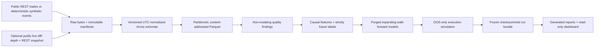

# Order Flow to Price Impact

A research-only, event-driven market-microstructure platform for asking:

> When do order-flow imbalance, liquidity, and limit-order-book conditions
> predict short-horizon price movement, and how much apparent value survives
> fees, latency, uncertain fills, adverse selection, and inventory risk?

The project is deliberately reproducibility-first. It keeps market-data evidence,
predictive diagnostics, execution assumptions, and simulated outcomes separate.
It has no authenticated exchange client, account connection, or order-entry path.

> **Evidence boundary:** `SYNTHETIC_SMOKE` output verifies software behavior only.
> It is not market, alpha, profitability, or investment evidence.

## Architecture



The normalized event contract retains exchange time, local receipt time when
captured, the conservative availability clock used by research, exact integer
ticks/lots, sequence identifiers, and a continuity epoch. Features, labels,
folds, open orders, and markouts cannot cross a known book gap.

## Quick start

Python 3.12 is required. The default acceptance path is deterministic and does
not need internet access:

```bash
make setup
make check
make reproduce-sample
make report
```

The frozen sample is written to `artifacts/runs/sample-smoke`; independently
rendered reports go to `artifacts/runs/sample-smoke-reports`. Both directories
are reproducible and intentionally ignored by Git.

To inspect the completed run:

```bash
make verify-run
make dashboard
```

The dashboard loads only checksum-verified artifacts. It does not download data,
fit models, rerun simulations, or place orders.

## Credential-free public sample

The bounded public path downloads BTCUSDT and ETHUSDT aggregate trades from a
fixed UTC interval, fetches `exchangeInfo` for exact tick and lot scales, keeps
the response bytes, and writes raw and normalized manifests:

```bash
make download-sample
.venv/bin/python -m microstructure.cli validate \
  --config configs/public_sample.toml
```

It uses Binance's public market-data-only REST base URL and requires no API key.
The adapter honors retryable status codes, `Retry-After`, and interrupted body
streams; paginates by trade ID to avoid losing tied timestamps; enforces a
response-byte ceiling; and imposes a small per-symbol row cap. Pages flow once
through disk-backed incremental validation into bounded Parquet batches. See
the official [Spot REST documentation](https://developers.binance.com/en/docs/products/spot/rest-api)
and [Spot WebSocket stream guide](https://developers.binance.com/en/docs/catalog/core-trading-spot-trading/api/ws-streams/~).

Historical public trade ingestion and live order-book collection are separate on
purpose. Public historical Spot depth is not assumed to exist. A book-based
empirical study begins only after a continuous local snapshot/delta epoch has
been captured and passed sequence checks.

Producing a public research bundle never scans for a "latest" input. Select the
immutable ingestion manifest explicitly by both path and digest:

```bash
make reproduce-public-sample \
  PUBLIC_INGESTION_MANIFEST=data/_ingestion_manifests/<manifest>.json \
  PUBLIC_INGESTION_MANIFEST_SHA256=<64-character-sha256>
make verify-public-run
make report-public
```

## Frozen multi-date trade study

The prospective M8 trade-only study uses the complete BTCUSDT and ETHUSDT
Binance Spot daily aggregate-trade archives for 2024-01-03 through 2024-01-06.
Acquisition is deliberately separate from research production:

```bash
# Networked, raw-only: authenticates ZIP/CHECKSUM/metadata evidence but never
# opens a CSV member or reads an economic field.
make download-m8

# Copy the manifest path and lowercase SHA-256 printed by download-m8.
# Production requires the exact clean committed source tree.
make reproduce-m8 \
  M8_RAW_MANIFEST=data/m8/_manifests/<manifest>.json \
  M8_RAW_MANIFEST_SHA256=<64-character-sha256>
make verify-m8-run \
  M8_RAW_MANIFEST=data/m8/_manifests/<manifest>.json \
  M8_RAW_MANIFEST_SHA256=<64-character-sha256>
make report-m8 \
  M8_RAW_MANIFEST=data/m8/_manifests/<manifest>.json \
  M8_RAW_MANIFEST_SHA256=<64-character-sha256>
```

The producer opens and validates only the train and validation members first.
It fits and calibrates the selected model and an independent historical prior
exactly once on development data, persists their canonical numeric preprocessing
and estimator states in each per-symbol lock, closes one aggregate lock, and
revalidates the exact protocol, config, Git/source identity, raw authority,
development manifest, fitted-state hashes, and child locks immediately before
every held-out member is opened. Held-out evaluation restores those states with
no fit, refit, recalibration, or update.
A declared-data failure becomes an immutable `INSUFFICIENT_DATA` bundle with no
replacement date or endpoint predictions. A successful bundle remains
trade-only: execution, P&L, capacity, significance, and cross-instrument pooling
are unauthorized by the protocol.

That failure branch is the observed outcome of the declared study. The canonical
bundle at `artifacts/runs/binance-m8-multidate` stopped on the ETHUSDT training
archive after complete normalization found 53 `temporal.long_silence` warnings.
BTCUSDT training normalization had already completed with 2,071,461 rows and no
findings; ETHUSDT contributed 987,297 rows, zero errors, and 53 warnings. The
producer did not start selection, create a development lock, open either held-out
date, publish a prediction, or run execution. This is a valid, checksummed
`INSUFFICIENT_DATA` result, not an incomplete attempt and not evidence against or
for the economic hypothesis.
`report-m8` revalidates the terminal and its external raw authority, then renders
the failure report into a separate report directory. It does not repair, append
to, or otherwise mutate the canonical failure bundle.

## Frozen live-L2 sessions — replacement campaign v2

Each declared date is captured by one command that waits for the exact common
UTC barrier and starts both public market-data feeds under one authority. It
never authenticates or exposes an order-entry path:

```bash
make capture-m8-l2-session M8_L2_SESSION_DATE=2026-08-10
```

The superseded v1 campaign is retained as historical control evidence: Aug 8
was a verified `MISSED_WINDOW`, Aug 9 completed, and its development authority
is permanently `NOT_CREATED`. It is not rewritten or used by v2. Before any v2
session was observed, the user explicitly reset the empirical campaign to Aug
10 train, Aug 11 validation, Aug 12 primary test, and Aug 13 replication test,
each at 14:00--15:00 UTC. A missed, disconnected, gapped, warning-bearing, or
otherwise insufficient v2 date is frozen as such and is never replaced. Only
checksum-verified `COMPLETE` bundles may expose economic frames.
A verified held-out `INSUFFICIENT_DATA` bundle may be consumed only as control
evidence for an aggregate insufficiency terminal; its economic frames are never
opened.

The analysis specification is separately frozen in
[`docs/M8_L2_ANALYSIS_CONTRACT.md`](docs/M8_L2_ANALYSIS_CONTRACT.md). Its strict
loader, session input verifier, observed-interval feature/label construction,
Aug 10/11 development-authority producer, no-refit Aug 12/13 evaluation, market-only
execution evaluator, descriptive diagnostics, and artifact-driven report
renderers are integrated behind tested CLI/Make producers and recursive
verifiers. The software path is complete; no v2 session data existed when the
10--13 calendar and authority bytes were fixed, so v2 may reach either a valid
complete result or an honest insufficiency terminal. No L2 metric or execution
result is claimed before those terminals exist. During the campaign, live
status belongs only to the immutable campaign/session authorities; this tracked
README must not be revised between sessions.
Use the ignored run targets
`artifacts/runs/binance-m8-l2-development-lock` for the durable development
authority and `artifacts/runs/binance-m8-live-l2` for the final campaign bundle;
do not place mutable study state in a source-controlled path.

### Frozen L2 operating sequence

Every later command requires explicit authorities; none scans for a "latest"
bundle. The Make targets default to the frozen
`M8_L2_CONFIG=configs/m8_l2_capture_study.toml` and
`M8_L2_ANALYSIS_CONFIG=configs/m8_l2_analysis.toml`; do not substitute either
during the campaign. After each capture, retain the emitted JSON. Its
`output_root`, `session_manifest_sha256`, and `checksums` fields identify the
bundle, manifest digest, and checksum file. Independently hash that exact
checksum file:

```bash
shasum -a 256 /absolute/session/bundle/checksums.sha256
```

Map those values without abbreviation to the role-specific Make variables:

- `M8_L2_<ROLE>_BUNDLE_DIR`
- `M8_L2_<ROLE>_MANIFEST_SHA256`
- `M8_L2_<ROLE>_CHECKSUMS_SHA256`

where `<ROLE>` is `TRAIN`, `VALIDATION`, `PRIMARY`, or `REPLICATION`. Make accepts
these as command-line assignments or exported environment variables. First
verify every session. After the Aug 11 validation terminal, create and verify the
development authority before any held-out analysis. If both development
sessions are `COMPLETE`, the authority is `LOCKED` and contains the eight fitted
child states. If either is a valid `INSUFFICIENT_DATA` terminal, the authority is
`NOT_CREATED`; it contains typed control evidence and deliberately opens no
economic frame. In either case it is immutable, and the Aug 12/13 captures must
still proceed on their declared dates:

```bash
make verify-m8-l2-session M8_L2_BUNDLE_DIR=/absolute/session/bundle

make lock-m8-l2-development \
  M8_L2_DEVELOPMENT_LOCK_DIR=artifacts/runs/binance-m8-l2-development-lock \
  M8_L2_TRAIN_BUNDLE_DIR=... M8_L2_TRAIN_MANIFEST_SHA256=... \
  M8_L2_TRAIN_CHECKSUMS_SHA256=... \
  M8_L2_VALIDATION_BUNDLE_DIR=... M8_L2_VALIDATION_MANIFEST_SHA256=... \
  M8_L2_VALIDATION_CHECKSUMS_SHA256=...

make verify-m8-l2-development-lock \
  M8_L2_DEVELOPMENT_LOCK_DIR=artifacts/runs/binance-m8-l2-development-lock \
  M8_L2_DEVELOPMENT_LOCK_SHA256=... \
  M8_L2_TRAIN_BUNDLE_DIR=... M8_L2_TRAIN_MANIFEST_SHA256=... \
  M8_L2_TRAIN_CHECKSUMS_SHA256=... \
  M8_L2_VALIDATION_BUNDLE_DIR=... M8_L2_VALIDATION_MANIFEST_SHA256=... \
  M8_L2_VALIDATION_CHECKSUMS_SHA256=...
```

Use the `development_lock_sha256` printed by the command for either `LOCKED` or
`NOT_CREATED`. The direct CLI returns 1 for a valid `NOT_CREATED` command or
verification; the Make wrapper normalizes that research-terminal code to 0.
In both cases inspect the JSON status and preserve its `development_lock.json`,
exact `_NOT_CREATED` marker (`not-created\n`), and printed authority SHA instead
of retrying or changing dates. After Aug 13, pass
the same development coordinates plus both held-out authorities to the final
producer. A `NOT_CREATED` authority forces an aggregate `INSUFFICIENT_DATA`
result, opens no economic frames from any of the four sessions, and reports the
union of development and held-out control reasons. The command below explicitly
lists all four role triplets; none may be omitted or discovered by wildcard:

```bash
make reproduce-m8-l2 \
  M8_L2_DEVELOPMENT_LOCK_DIR=artifacts/runs/binance-m8-l2-development-lock \
  M8_L2_DEVELOPMENT_LOCK_SHA256=... \
  M8_L2_TRAIN_BUNDLE_DIR=... M8_L2_TRAIN_MANIFEST_SHA256=... \
  M8_L2_TRAIN_CHECKSUMS_SHA256=... \
  M8_L2_VALIDATION_BUNDLE_DIR=... M8_L2_VALIDATION_MANIFEST_SHA256=... \
  M8_L2_VALIDATION_CHECKSUMS_SHA256=... \
  M8_L2_PRIMARY_BUNDLE_DIR=... M8_L2_PRIMARY_MANIFEST_SHA256=... \
  M8_L2_PRIMARY_CHECKSUMS_SHA256=... \
  M8_L2_REPLICATION_BUNDLE_DIR=... M8_L2_REPLICATION_MANIFEST_SHA256=... \
  M8_L2_REPLICATION_CHECKSUMS_SHA256=...
```

The producer prints `run_manifest_sha256` and `checksums_sha256`. Reuse the full
four-session/development authority set and add those two values for
`verify-m8-l2-run` and `report-m8-l2`. If that full set has been exported under
the exact Make variable names above, the terminal commands are:

```bash
make verify-m8-l2-run M8_L2_RUN_MANIFEST_SHA256=... \
  M8_L2_RUN_CHECKSUMS_SHA256=...
make report-m8-l2 M8_L2_RUN_MANIFEST_SHA256=... \
  M8_L2_RUN_CHECKSUMS_SHA256=...
```

`report-m8-l2` recursively verifies the final run and all external authorities,
then writes to `artifacts/runs/binance-m8-live-l2-reports`. It never modifies the
immutable run bundle. At the direct CLI boundary, capture, development, final
producer, verifier, and report commands use exit 1 for a valid insufficiency
terminal; Make maps that one code to success because GNU Make otherwise collapses
it into a generic error. Automation must inspect the emitted JSON status and
exact marker rather than infer research status from Make's process code or retry
with changed dates or rules.

## Commands

| Command | Purpose |
| --- | --- |
| `make setup` | Create/synchronize the locked Python 3.12 environment |
| `make download-sample` | Download the bounded credential-free public trade sample |
| `make download-m8` | Acquire the frozen M8 raw authority without opening archive members |
| `make capture-m8-l2-session M8_L2_SESSION_DATE=YYYY-MM-DD` | Capture the frozen concurrent BTCUSDT/ETHUSDT L2 session for one declared date |
| `make verify-m8-l2-session M8_L2_BUNDLE_DIR=<path>` | Verify a complete or `INSUFFICIENT_DATA` frozen L2 session bundle |
| `make lock-m8-l2-development` | Atomically publish the Aug 10/11 development authority: fitted `LOCKED` state when both sessions pass, or control-only `NOT_CREATED` evidence when either is insufficient |
| `make verify-m8-l2-development-lock` | Recursively verify either development-authority status against its path, SHA, configs, sessions, campaign, and clean source identity |
| `make reproduce-m8-l2` | Produce a new immutable four-session L2 terminal bundle; use the explicit-digest verifier for an existing target |
| `make verify-m8-l2-run` | Verify a complete or `INSUFFICIENT_DATA` L2 run plus all external authorities |
| `make report-m8-l2` | Re-render verified L2 reports into a separate directory without mutating the run |
| `make validate-data` | Run offline, non-mutating validation on the synthetic fixture |
| `make validate-public-data` | Validate configured public normalized partitions incrementally |
| `make smoke` | Produce or verify the immutable synthetic vertical slice |
| `make test` | Run all unit and integration tests without network access |
| `make reproduce-sample` | Alias for the canonical smoke producer |
| `make reproduce-public-sample` | Produce a trade-only run from an explicit manifest path + SHA |
| `make reproduce-m8` | Produce M8 from an explicit raw manifest + SHA under a clean commit |
| `make verify-run` | Verify run structure and every protected checksum |
| `make verify-public-run` | Verify the explicit public run bundle |
| `make verify-m8-run` | Verify a complete or `INSUFFICIENT_DATA` M8 terminal bundle |
| `make report` | Render a fresh report set from the frozen bundle |
| `make report-m8` | Render a complete M8 bundle or expose its frozen failure report |
| `make dashboard` | Open the local read-only Streamlit research dashboard |
| `make check` | Run Ruff, strict mypy, pytest, and the smoke producer |

The equivalent CLI is available as `microstructure` after setup. Run
`microstructure --help` for the `ingest`, `acquire-m8`, `validate`, `reproduce`,
`reproduce-m8`, `verify-m8`, `report-m8`, generic `verify`/`report`, the frozen
`capture-m8-l2-session`, `verify-m8-l2-session`, `lock-m8-l2-development`,
`verify-m8-l2-development-lock`, `reproduce-m8-l2`, `verify-m8-l2-run`, and
`report-m8-l2` commands, plus exploratory research-only `collect-l2`.

## What is implemented

- Credential-free aggregate-trade ingestion with bounded retries, raw response
  preservation, symbol metadata, exact scaling, immutable manifests, and
  streaming partitioned Parquet writes. A verified public reader performs
  physical-order incremental DQ and a single upstream Parquet pass into a
  spill-capable DuckDB canonical sort; eager compatibility reads have a separate
  hard row limit.
- Optional public live diff-depth capture plus REST snapshot anchoring and pure
  `U/u` reconstruction with stale, overlap, gap, crossed-book, and invariant
  checks. Reconnection starts a new continuity epoch. The frozen L2 runner uses
  one absolute UTC barrier for both instruments, a byte-bounded receiver queue,
  OBSERVED-only continuity intervals, cross-symbol overlap gates, exhaustive
  artifact inventory, and atomic `COMPLETE`/`INSUFFICIENT_DATA` evidence.
- Typed quality findings for duplicates, ordering and clocks, invalid values,
  scale mismatches, abnormal spread, silence, gaps, and crossed books. Validation
  never repairs observations.
- Leakage-safe spread, L1/L5/L10 depth state, queue imbalance, microprice, OFI,
  signed flow, intensity, volatility, observable zero-quantity cancellation,
  causal lagged impact/recovery, regime, and stability features, with event-time
  and clock-time labels and explicit censoring.
- A common-fold model ladder: historical prior, unpenalized logistic regression,
  L2-regularized logistic grid, and shallow tree. Selection uses validation data;
  the final test is frozen. Calibration and protocol-specific paired bootstrap
  diagnostics are serialized with their block count, status, and seed: the
  trade-only study uses fixed dependency blocks, while the prospective L2 study
  uses interval-local overlapping moving blocks. Neither is presented as a
  complete model of cross-instrument or overlapping-label dependence.
- OOS-only market/limit simulation with decision and order latency, maker/taker
  fees, adverse price rounding, top-depth caps, partial fills, a declared queue
  proxy, adverse selection, inventory limits, liquidation, turnover, and size
  sensitivity.
- Atomic run production. `_SUCCESS` is written last; every other file is covered
  by `checksums.sha256`. A completed target is read-only and reusable only when
  the caller supplies its previously retained manifest and checksum digests to
  the recursive verifier.
- Raw-only M8 acquisition with exact official CHECKSUM evidence, bounded ZIP
  central-directory inspection, a hard retained-evidence byte ledger, an exact
  content-addressed inventory, and an atomic self-contained bundle copy. The M8
  producer enforces development-only normalization and final selected/prior
  fitting before a durable analysis lock, restores transparent numeric states
  for prediction, and fails closed at every held-out member-open boundary.
- Frozen L2 campaign identity and strict session readers that reject changed
  clean-source identities, tampered or symlinked artifacts, invalid Parquet
  footers/schemas, row mismatches, and continuity violations before exposing a
  frame. One outcome-blind nonce binds all dates to the canonical output-root
  path/filesystem identity, loaded source/import origin, and a hashed fingerprint
  of Python, platform, and eight production dependency versions. Development-only
  regime/model locks, no-refit held-out evaluation, paired dependency-block
  diagnostics, market-only scenarios, descriptive analyses, and generated L2
  reports feed one atomic final producer. Fail-closed memory admissions reserve
  at most 8 GiB for development materialization and 12 GiB for final production
  (raw, causal, evaluation, descriptive, and execution workspaces), leaving at
  least 4 GiB of the 16 GiB host envelope for the interpreter and libraries;
  every major allocation is checked before and immediately after materialization.
  Its verifier streams tabular checks,
  recursively revalidates the four external sessions and development authority,
  binds a self-contained authority snapshot, rejects tampering, and enforces
  `COMPLETE` versus `INSUFFICIENT_DATA` semantics.
- Generated technical report, two-page IC memo, held-out comparison table, and
  six-tab Streamlit dashboard, all downstream of frozen serialized artifacts.

## Run contents

Each completed run includes:

```text
run_manifest.json             # data interval, symbols, artifact map, assumptions
provenance.json               # config/input hashes, seed, runtime, Git commit/state
resolved_config.json
data/normalized/              # partitioned Parquet + immutable manifests
quality/summary.json
research/                     # full/evaluation frames and exact fold indices
models/                       # all predictions and selected held-out predictions
metrics/                      # predictive, execution, and sensitivity diagnostics
execution/                    # orders, fills, positions, replay state
reports/                      # code-generated report, memo, comparison table
dashboard/market_state.parquet
checksums.sha256
_SUCCESS
```

The final L2 bundle uses the same immutable terminal convention but has its own
study inventory: self-contained `authority/` snapshots, per-date/symbol/endpoint
`causal_frames/`, locked `evaluation/`, seven descriptive analyses, partitioned
market-scenario orders/fills/positions plus assumptions and metrics, a
checksummed `report_inputs.json`, and three generated reports. An
`INSUFFICIENT_DATA` terminal retains the exact authorities, any allowable causal
evidence, report snapshot, and failure reports while omitting promoted
evaluation, descriptive, and execution artifacts. The recursive verifier checks
physical inventory, Parquet semantic claims, rendered-report equality, and all
external authorities. Exactly one final marker closes the bundle: `_SUCCESS`
contains `complete\n` for `COMPLETE`, while `INSUFFICIENT_DATA` contains
`terminal\n` for the typed data-availability terminal.

The semantic run key is derived from the configuration, immutable input identity,
Git commit, the exact tracked/non-ignored source-tree digest, and seed—not
generation timestamps. Reuse additionally requires the current source identity
and caller-retained output manifest/checksum digests to match; an older or
coordinatedly rewritten bundle cannot masquerade as evidence for changed code.

## Main findings and current evidence

Replacement-campaign source-freeze snapshot as of 2026-08-09:

- The latest settled integration gates passed Ruff, formatting, strict mypy, and
  the full pytest suite across the data, reconstruction, timing, modeling,
  execution, reporting, dashboard, and pipeline boundaries. Exact test/module
  counts belong to the dated verification ledger in `STATUS.md`, not to an
  empirical claim.
- A fixed public sample for 2024-01-02 downloaded and normalized 10,000 real
  aggregate trades: 5,000 each for BTCUSDT and ETHUSDT. The configured cap was
  reached for both instruments, so both ranges are explicitly marked incomplete.
  The current validators reported zero errors and zero warnings on those rows.
- The generated trade-only report serializes per-symbol paired held-out
  model-minus-prior diagnostics without pooling instruments. Exact metrics live
  only in the checksum-verified run bundle; they are not manually copied into
  this file.
- The single-date, cap-truncated, validation-selected diagnostics do
  not authorize a statistical-significance, persistent-alpha, profitability,
  or capacity claim. The public bundle records execution and P&L as `NOT_RUN`;
  synthetic model/P&L values are never interpreted economically.
- The prospective M8 acquisition, lock-before-open producer, failure bundle,
  verifier, and report interfaces are implemented and tested offline. The eight
  official archives and their CHECKSUM/metadata evidence are now present in the
  verified raw-only authority
  `data/m8/_manifests/m8-acquisition.manifest-04d5c01f3810b6a300ec.json`
  (SHA-256 `04d5c01f3810b6a300ec0f9317052f254b2bec5d89bc0dfefd18cd71ad6582e6`).
  The raw-acquisition phase opened no CSV member. The corrected clean-source
  producer then published and verified the canonical
  `artifacts/runs/binance-m8-multidate` terminal at commit
  `88060613abe211cd8e80a3499678fca830f8ba2d`. It stopped at the declared ETHUSDT
  training DQ gate with 53 warnings, before selection, locks, or held-out access;
  execution is `NOT_RUN`. The bundle, rather than this summary, is the authority
  for its exact status and evidence inventory.
- The live-L2 capture protocol and analysis contract are frozen, and strict
  capture, session-verification, input, development-lock, locked-evaluation,
  market-scenario, descriptive-analysis, and report components are covered by
  offline tests. The superseded v1 evidence is preserved separately; no v2
  Aug 10--13 L2 session existed at this source freeze, so these tracked bytes
  contain no v2 book-based empirical result.

This distinction is the main research conclusion so far: a functioning simulator
is not evidence that a market effect exists.

## Limitations and next milestone

Exchange timestamps are not colocated receipt times. Public trades cannot reveal
true queue priority, hidden liquidity, cancellations, or endogenous impact. The
limit-fill mechanism is therefore a scenario proxy, and reported sensitivity is
not deployable capacity. A short crypto interval cannot generalize across dates,
venues, or asset classes; overlapping horizons also reduce effective sample size
and make multiplicity control necessary.

The trade-only study is closed at its predeclared `INSUFFICIENT_DATA` gate and
must not be rerun with replacement dates or a relaxed warning policy. The next
empirical milestone is the already-frozen prospective, simultaneous
BTCUSDT/ETHUSDT local-L2 study. It requires four declared session terminals, a
single clean campaign source identity, continuous valid observed intervals, an
Aug 10/11 development authority durably published before either held-out session,
and unchanged Aug 12/13 evaluation when that authority is `LOCKED`. A
`NOT_CREATED` authority records why fitting was forbidden, while the declared
held-out captures still proceed and the final producer opens no economic frame.
A failed session remains evidence of insufficiency; no trade-only result can
substitute for book evidence.

See [the research protocol](docs/RESEARCH_PROTOCOL.md), [data contract](docs/DATA_CONTRACT.md),
[project plan](docs/PROJECT_PLAN.md), [decision log](docs/DECISION_LOG.md),
[L2 analysis contract](docs/M8_L2_ANALYSIS_CONTRACT.md), and
[methodology limitations](reports/methodology_limitations.md) for the exact
contracts and promotion rules.

## Portfolio material

The source-controlled report files contain no manually pasted performance
numbers. Run-specific documents are generated from verified bundles. Supporting
communication artifacts are in `portfolio/`: an interview narrative, three
resume-bullet variants, and a ten-minute presentation outline.

## Public release

- Project page: <https://yangxiaoshawn.github.io/projects/microstructure/>
- GitHub source: <https://github.com/YangXiaoShawn/open-economic-quant-microstructure>
- Versioned code and documentation mirror: <https://huggingface.co/datasets/ShawnChamberlain/open-economic-quant-research-data/tree/main/Microstructure>
- Interactive evidence explorer: <https://huggingface.co/spaces/ShawnChamberlain/open-economic-quant-research-observatory>
- Publication and data boundaries: [docs/PUBLICATION.md](docs/PUBLICATION.md) and [docs/DATA_POLICY.md](docs/DATA_POLICY.md)

Licensed under the MIT License. This repository is for research and simulation,
not investment advice or live trading.
