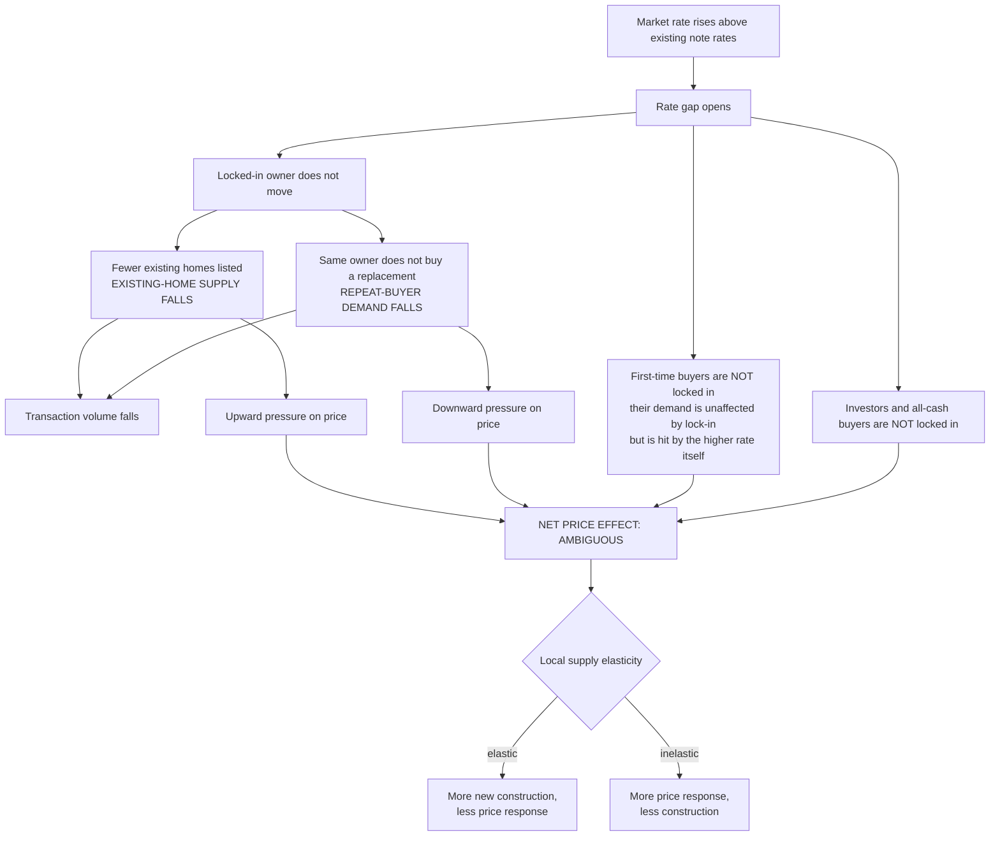

# Demand versus Supply Decomposition

<!-- GENERATED by `make report` (lockin.reporting.render). DO NOT HAND-EDIT. -->

*Why lock-in reduces transactions unambiguously but has an ambiguous price effect.*

| | |
|---|---|
| Generated | `2026-08-13T17:12:55+00:00` |
| Git commit | `5d2e6a4a33f9-dirty` |
| Config | `full` (digest `fa3707f77cbdb74a`) |
| Data class | **REGISTERED** |
| Data period | `2021-01..2024-12` |
| Artifacts used | 6 |
## 1. The central asymmetry

A locked-in owner is **both** a potential seller and a potential buyer. When the rate gap makes moving expensive, that household withdraws from *both* sides of the market at once.

**Quantities are unambiguous; prices are not.** Both channels reduce transaction volume, so purchase-mortgage originations should fall with exposure. The price effect depends on which side is more inelastic, on the share of demand from first-time buyers and investors (who are not locked in), and on how readily new construction substitutes for existing homes.

> **A fall in transactions is not evidence of a supply-only mechanism.** This is the single most common inferential error in casual accounts of lock-in. The same aggregate decline in sales is consistent with a pure listing-side contraction, a pure repeat-buyer-demand contraction, or any mixture.

## 2. What the evidence in this repository can and cannot separate

| channel | measurable here? | with what |
|---|---|---|
| Locked-in owners listing fewer homes | **no, not separately** | no listings data and no sale indicator |
| Locked-in owners buying fewer homes | **no, not separately** | would need to link a payoff to a subsequent purchase by the same household |
| Combined effect on transaction volume | **yes** | HMDA purchase originations by state-year |
| First-time-buyer demand | partially | HMDA does not flag first-time status; the loan-level file does, but only for purchase loans it acquired |
| Investor demand | partially | Freddie `Occupancy Status` = `I`, but investor activity is concentrated in cash and non-agency channels we never see |
| New construction | **yes** | Census BPS units authorized |
| Local migration | **no** | no migration adapter in the critical path |
| Credit availability | partially | HMDA denial rate |

The honest summary: this design identifies the **combined** withdrawal, not its decomposition. Claiming a decomposition would require listings data, transaction records, or a household panel.

## 3. Sign table from the estimated results

No sign is presumed. Each cell reports what the artifacts actually show, with the tier that governs how it may be read.

| outcome | mean post effect (per 1 s.d. exposure) | tier | pre-trend | reading |
|---|---|---|---|---|
| purchase originations (log) | 0.0001 | `descriptive` | fail | descriptive only — pre-trend fails or is untestable |
| refinance originations (log) | -0.0689 | `descriptive` | fail | descriptive only — pre-trend fails or is untestable |
| house price growth | -0.0007 | `descriptive` | pass | describes |
| single-family permits (log) | -0.0207 | `quasi_experimental` | pass | reduced |
| multifamily 5+ permits (log) | -0.0165 | `descriptive` | fail | descriptive only — pre-trend fails or is untestable |

## 4. The loan-level gradient that motivates the market-level design

The monthly prepayment hazard falls from **0.06909** in the most-refinance-incentivised bucket to **0.03077** in the most-locked-in bucket — a ratio of roughly **2.2×**.

*Evidence tier: `hazard_association`.* This gradient is the borrower-level mechanism the market-level design is looking for. It is **not** itself evidence about listings, sales, moves, or prices.

## 5. Why the price sign matters for policy

If lock-in raises prices (listing channel dominates), policies that unlock existing owners improve affordability by adding supply. If lock-in lowers prices (repeat-buyer channel dominates), the same policies add demand and could raise prices while raising transaction volume. **The two cases imply opposite affordability consequences from the same intervention**, which is why `reports/policy_counterfactuals.md` reports quantity and price responses separately and never nets them into a single welfare claim.

The supply-elasticity scenario in the policy module exists to make this concrete: the *same* modelled demand shift produces mostly-quantity or mostly-price responses depending on a calibrated elasticity that this project does not estimate.

### Artifacts this report was built from

| artifact | tier | population | weight |
|---|---|---|---|
| `eventstudy/es_log_purchase_originations` | `descriptive` | U.S. states present in both the Freddie Mac loan sample and the public… | geography-year (unweighted OLS) |
| `eventstudy/es_log_refi_originations` | `descriptive` | U.S. states present in both the Freddie Mac loan sample and the public… | geography-year (unweighted OLS) |
| `eventstudy/es_hpi_growth` | `descriptive` | U.S. states present in both the Freddie Mac loan sample and the public… | geography-year (unweighted OLS) |
| `eventstudy/es_log_permits_1unit` | `quasi_experimental` | U.S. states present in both the Freddie Mac loan sample and the public… | geography-year (unweighted OLS) |
| `eventstudy/es_log_permits_5plus` | `descriptive` | U.S. states present in both the Freddie Mac loan sample and the public… | geography-year (unweighted OLS) |
| `hazards/gap_profile_nonlinear` | `hazard_association` | Loans in the ingested Freddie Mac Single-Family cohorts: conventional,… | loan-month, sampling weight applied |

### Source versions

| dataset | schema@retrieved#checksum |
|---|---|
| `active_mortgage_stock` | `active-stock-v1@2026-08-13T16:47:10+00:00#a256bff8ea10` |
| `bls_laus` | `bls-api-v2-laus-state-v1@2026-08-11T17:41:19+00:00#8cd9335cc5ae` |
| `census_bps` | `census-bps-state-monthly-v1@2026-08-13T09:27:18+00:00#d3e4a46f74a5` |
| `fhfa_hpi` | `fhfa-hpi-master-v1@2026-08-13T09:25:46+00:00#8ab042e042ff` |
| `freddie_llds_synthetic_fixtures` | `freddie-llds-2026-08-10@2026-08-13T09:29:56+00:00#68da95265c31` |
| `hmda` | `cfpb-data-browser-aggregations-v2@2026-08-13T09:27:18+00:00#6946b46cf136` |
| `loan_episodes` | `loan-episodes-v1@2026-08-13T17:07:29+00:00#ab7bd14c7982` |
| `loan_events` | `loan-events-v1@2026-08-13T10:30:40+00:00#29799211d300` |
| `local_market_panel_annual` | `local-panel-v1@2026-08-13T16:47:11+00:00#2ee1422e6608` |
| `local_market_panel_monthly` | `local-panel-v1@2026-08-13T16:47:11+00:00#5a4a9c5fa6c7` |
| `omb_cbsa_crosswalk` | `census-list1-v1@2026-08-13T09:27:19+00:00#222ea05e6b27` |
| `omb_cbsa_stability` | `census-list1-v1@2026-08-13T09:27:19+00:00#30514ffa77ff` |
| `pmms` | `pmms-history-v1@2026-08-13T09:25:46+00:00#c74cccece4a6` |
| `teleworkable_msa` | `dingel-neiman-2020-v1@2026-08-13T09:27:18+00:00#e19e017515e6` |
| `teleworkable_state` | `dingel-neiman-2020-v1@2026-08-13T09:27:18+00:00#f663415361e4` |

---

**Data sources.** Freddie Mac Single-Family Loan-Level Dataset (registered; subject
to Freddie Mac terms of use; not redistributed here) — or labeled synthetic fixtures
where indicated. Freddie Mac Primary Mortgage Market Survey. Federal Housing Finance
Agency House Price Index. Home Mortgage Disclosure Act data via the Consumer
Financial Protection Bureau Data Browser. U.S. Census Bureau Building Permits Survey.
Retrieval timestamps and file checksums are recorded in the manifests accompanying
each result artifact.
